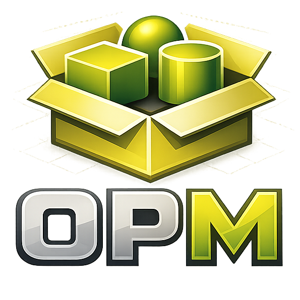

    

# Openscad Package Manager (opm)

## 📌 Introduction

OpenSCAD Package Manager (opm) is a package manager for OpenSCAD witten in GO that allows you to install, update, and manage OpenSCAD modules and dependencies from Git repositories.
It aims to simplify the integration of third-party libraries into your OpenSCAD projects.

## ✨ Features

- Initialize an OpenSCAD project
- Install packages
- List installed packages
- Uninstall packages
- Display information about a package
- Manage package repositories
